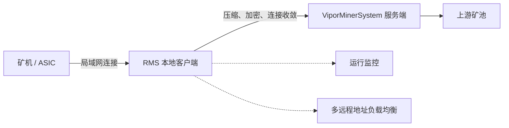
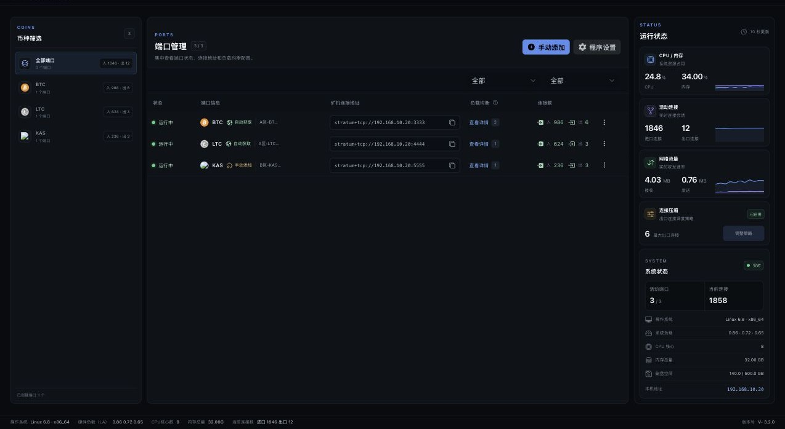

<div align="center">


# RMS

### 面向矿场局域网的 ViporMinerSystem 安全接入客户端

压缩公网流量与出口连接数，为本地矿机提供统一、可观测的 ViporMinerSystem 接入入口。

</div>

> [!IMPORTANT]
> RMS 是 ViporMinerSystem 的可选本地客户端，不能单独替代 ViporMinerSystem 服务端。矿机数量较少、网络稳定且带宽充足时，也可以不部署 RMS，直接连接 ViporMinerSystem。

## RMS 如何工作



RMS 通常部署在矿场局域网内。矿机连接本地 RMS 地址，由 RMS 负责与远程 ViporMinerSystem 服务端建立压缩传输链路。

## 核心能力

| 能力 | 说明 |
| --- | --- |
| 公网流量压缩 | 使用 RMS3、RMS3(Zstd) 或 RMS3(NB) 降低公网传输体积 |
| 连接数收敛 | 将大量矿机连接复用为更少的公网出口连接 |
| 加密传输 | RMS 与 ViporMinerSystem 之间使用受保护的协议链路 |
| 自动配置 | 通过服务端推送地址自动同步端口配置 |
| 手动端口 | 可手动设置本地端口、远程服务器、币种、协议及密码 |
| 负载均衡 | 一个本地端口可以配置多个兼容的远程服务地址 |
| 运行监控 | 查看进出口连接、CPU、内存、网络和端口状态 |
| 后台安全 | 支持访问密码和自定义安全访问路径 |

## 控制台预览



> 截图使用脱敏的示例矿场数据，界面组件与样式来自 RMS 3.2.0 实际前端工程。

## 协议怎么选

| 协议 | 建议场景 | 注意事项 |
| --- | --- | --- |
| `RMS3(NB)` | BTC、LTC 大规模接入 | 仅支持 BTC 和 LTC；特定测试条件下公网流量最高可减少 99.6% |
| `RMS3(Zstd)` | 希望兼顾压缩效果与 CPU 占用 | 与 RMS3 使用相同的连接逻辑，通常对 CPU 更友好 |
| `RMS3` | 通用高压缩场景 | 压缩级别越高，CPU 压力通常越大 |
| `RMS2` | 对接历史 RMS2 服务端端口 | 用于兼容历史部署，不代表 RMS3 协议向下兼容 |

> [!CAUTION]
> 本地 RMS 的币种、协议、端口密码和压缩设置必须与 ViporMinerSystem 服务端端口一致。实际压缩效果与币种、矿机协议、连接数量、压缩参数和硬件性能有关，请以部署实测为准。

## 支持平台

| 平台 | 架构或版本 | 推荐方式 |
| --- | --- | --- |
| Linux | x86-64 | 安装脚本 |
| Linux / OpenWrt | ARMv7 | 安装脚本或手动下载 |
| Linux / OpenWrt | AArch64 | 安装脚本或手动下载 |
| Windows | x64 图形界面 | 下载 GUI 客户端 |
| Windows | x64 命令行 | 下载控制台客户端 |

由于 OpenWrt 发行版和硬件差异较大，建议先确认 CPU 架构，并从少量矿机开始验证。

## Linux 快速安装

安装前请确认：

- 已准备好 ViporMinerSystem 服务端 RMS 协议端口。
- RMS 设备具有固定局域网 IP。
- 使用 `root` 用户执行安装。
- 已阅读下面的系统变更说明。

```bash
sudo -i
bash <(curl -s -L https://raw.githubusercontent.com/VIPORMiner/RMS/main/install.sh)
```

如果设备无法访问 GitHub，可以使用备用线路：

```bash
sudo -i
bash <(curl -s -L -k https://vippool.cn/install.sh)
```

> [!NOTE]
> 备用线路当前通过 HTTP 提供。建议仅在可信网络中使用，并在执行前先下载和检查脚本内容。

安装脚本会自动识别常见 CPU 架构，也可以在菜单中手动选择：

- `x86-64`
- `armv7-musleabihf`
- `aarch64`

安装成功后，在同一局域网的浏览器中访问：

```text
http://RMS设备IP:42703
```

### 安装脚本会做什么

当前 Linux 脚本会：

- 将 RMS 安装到 `/root/rms`。
- 创建并启用 RMS 系统服务。
- 配置开机自启动。
- 调整系统文件句柄限制。
- 在部分 Linux 发行版中尝试关闭系统防火墙。

> [!WARNING]
> 生产环境执行前建议先审查 [`install.sh`](install.sh)。安装完成后，请根据实际网络重新配置防火墙，只允许可信局域网访问 RMS 管理端口和矿机监听端口。不要直接把 `42703` 管理端口暴露到公网。

## Windows 下载

| 文件 | 下载 | 说明 |
| --- | --- | --- |
| 图形界面主程序 | [rms-production-gui.exe](https://github.com/ViporMiner/RMS/raw/refs/heads/main/windows-gui/rms.exe) | 推荐普通 Windows 用户使用 |
| GUI 运行库 | [WebView2Loader.dll](https://github.com/ViporMiner/RMS/raw/refs/heads/main/windows-gui/WebView2Loader.dll) | 与 GUI 主程序放在同一目录 |
| 命令行版本 | [rms-production.exe](https://github.com/ViporMiner/RMS/raw/refs/heads/main/windows-no-gui/rms.exe) | 适合命令行和自定义进程管理 |

Windows 图形界面版本需要 Microsoft Edge WebView2。若启动后白屏，请安装 [Microsoft Edge WebView2 Runtime](https://developer.microsoft.com/microsoft-edge/webview2/consumer/) 后重新启动 RMS。

## 首次配置

### 1. 准备服务端

在 ViporMinerSystem 中创建与客户端匹配的 RMS2、RMS3、RMS3(Zstd) 或 RMS3(NB) 协议端口，并确认端口已经正常运行。

### 2. 连接服务端

首次进入 RMS 时，可以选择：

- 填写推送地址，自动同步服务端配置。
- 点击“跳过”，手动添加远程服务器。

### 3. 核对配置

确认客户端与服务端的以下设置一致：

- 币种。
- RMS 协议。
- 端口密码。
- RMS3 压缩参数。

手动添加的远程地址使用 `地址:端口` 格式。一个本地端口可以配置多个兼容的远程地址，RMS 会在可用地址之间分配连接。

### 4. 修改矿机地址

本地端口创建成功后，将矿机连接地址修改为：

```text
stratum+tcp://RMS局域网IP:本地监听端口
```

建议先接入少量矿机，确认连接数、算力和拒绝率正常后再逐批扩容。

## 连接压缩建议

RMS3 会按本地端口把矿机连接收敛为较少的公网出口连接。出口连接数越少，连接压缩程度越高，但 CPU、延迟和拒绝率也可能更加敏感。

- 使用 RMS3 或 RMS3(Zstd) 时，可从每 `100` 台矿机约 `1` 条出口连接开始测试。
- 使用 RMS3(NB) 且仅运行 BTC/LTC 时，可先测试每个端口 `3–6` 条出口连接。
- 不同币种和不同本地端口会分别建立出口连接。
- 扩容时同时观察 RMS CPU、进口/出口连接、服务端算力和上游拒绝率。

以上数值仅作为起点，不是所有硬件和网络环境的固定配置。

## 上线前安全检查

- 为 RMS 设备固定局域网 IP。
- 设置后台访问用户名和密码。
- 按需设置仅自己知道的安全访问路径。
- 使用防火墙限制管理后台和本地监听端口的访问来源。
- 不要将 RMS 管理后台直接暴露到公网。
- 记录当前协议与压缩参数，准备可以快速恢复的旁路地址。

安全访问路径设置后，访问 URL 末尾必须保留 `/`，例如：

```text
http://RMS设备IP:42703/private-path/
```

## Linux 日常维护

再次运行 Linux 安装命令即可进入管理菜单，支持：

- 安装或更新 RMS。
- 启动、停止和重启 RMS。
- 查看运行状态。
- 查看运行日志和错误日志。
- 设置或关闭开机启动。
- 卸载 RMS。

默认路径：

| 项目 | 路径或名称 |
| --- | --- |
| 安装目录 | `/root/rms` |
| 主程序 | `/root/rms/rms` |
| systemd 服务 | `rmservice` |
| 本地配置 | `/root/rms/local.conf` |
| 运行日志 | `/root/rms/nohup.out` |
| 错误日志 | `/root/rms/err.log` |
| 默认管理端口 | `42703` |

修改 `local.conf` 中的 `PORT` 后，需要重启 RMS 才会生效。

## 常见问题

<details>
<summary><strong>Windows 图形界面打开后白屏</strong></summary>

确认 `WebView2Loader.dll` 与 GUI 主程序位于同一目录。如果仍然白屏，请安装 Microsoft Edge WebView2 Runtime 后重新启动 RMS。

</details>

<details>
<summary><strong>矿机可以连接 RMS，但 RMS 无法连接服务端</strong></summary>

检查远程地址、服务端端口状态、网络防火墙，以及两端的币种、协议和密码是否一致。RMS3、RMS3(Zstd)、RMS3(NB) 与 RMS2 端口不能混用。

</details>

<details>
<summary><strong>如何让一个本地端口连接多台服务器</strong></summary>

在“手动添加”或“编辑端口”中添加多个远程地址。所有远程地址必须使用兼容的币种、协议和密码，RMS 会将进入该本地端口的连接分配到可用远程地址。

</details>

<details>
<summary><strong>如何修改默认管理端口</strong></summary>

Linux 脚本安装用户可以修改 `/root/rms/local.conf` 中的 `PORT`，保存后通过安装脚本菜单重启 RMS。修改后还需要同步调整防火墙规则和访问地址。

</details>

## 完整文档

- [ViporMinerSystem GitHub](https://github.com/ViporMiner/VIPORMiner)

## 仓库说明

本仓库用于分发 RMS 安装脚本和各平台预编译程序。`main` 分支只提供当前维护中的发布文件，历史独立客户端不再作为当前版本的快速安装入口。

历史部署仍可在当前客户端中选择 RMS2 协议连接兼容的服务端端口；RMS3 协议端口本身不向下兼容 RMS2。
